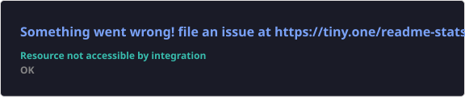

<!-- ============ HEADER ============ -->

  

  

  
  
  
  

---

##  About Me

I'm **Khizar Mehmood Cheema**, a **BS Data Science** student in my **3rd semester** at the **University of Engineering and Technology (UET), Lahore**. I love digging into data to find the story behind the numbers, and I'm building my skills in data insights, analytics and machine learning. Alongside data work, I also build apps and web projects, which helps me turn insights into real products.

- 🎓 Studying: **BS Data Science @ UET Lahore** (3rd semester)
- 📊 Focus: **Data insights, data analysis & visualization**
- 🤖 Learning: **Machine Learning**, Python data stack, SQL
- 📍 Based in: **Sialkot, Punjab, Pakistan**
- ⚡ Fun fact: a messy dataset is my favorite kind of puzzle

---

## 🛠️ Skills & Technologies

  
   
  

  
  
  
  
  

| Category       | Technologies                              |
|----------------|-------------------------------------------|
| **Data Science** | Python, Pandas, NumPy, Jupyter, Data Visualization |
| **Machine Learning** | scikit-learn, TensorFlow, PyTorch *(learning)* |
| **Databases**  | SQL, PostgreSQL, MySQL, Redis             |
| **Languages**  | Python, C++, C#, JavaScript               |
| **App & Web**  | Flutter, Dart, Node.js, React, WordPress  |
| **Tools**      | Git, GitHub, VS Code, Visual Studio       |

---

## 🚀 Featured Projects

<table>
<tr>
<td width="33%" valign="top">

### 🩺 [Breast Cancer Diagnosis ML](https://github.com/khizercheema78/breast-cancer-diagnosis-ml)
End-to-end ML pipeline comparing 4 classifiers with recall-focused tuning.
**99.1% test accuracy · 0.998 ROC-AUC**

`Python` `scikit-learn` `Matplotlib`

</td>
<td width="33%" valign="top">

### 🛍️ [Customer Segmentation (RFM)](https://github.com/khizercheema78/customer-segmentation-rfm)
RFM features + K-Means to find actionable marketing segments.
**14% of customers → 58% of revenue**

`pandas` `K-Means` `Silhouette`

</td>
<td width="33%" valign="top">

### 📊 [Retail Sales Insights Dashboard](https://github.com/khizercheema78/retail-sales-insights-dashboard)
Interactive Streamlit dashboard with KPIs, trends, heatmaps and auto-written insights.

`Streamlit` `Plotly` `pandas`

</td>
</tr>
</table>

---

## 📊 GitHub Stats

  
  

  

## 🏆 Trophies

  

## 🐍 Contribution Snake

  <picture>
    <source media="(prefers-color-scheme: dark)" srcset="./profile/snake-dark.svg"/>
    <source media="(prefers-color-scheme: light)" srcset="./profile/snake.svg"/>
    
  </picture>

---

## 🎓 Education

**BS Data Science** — University of Engineering and Technology (UET), Lahore · 3rd semester

## 📫 Contact

- **Email:** [khizercheema78@gmail.com](mailto:khizercheema78@gmail.com)
- **LinkedIn:** [Khizer Cheema](https://www.linkedin.com/in/khizer-cheema-769202294/)
- **Instagram:** [@khizercheema78](https://www.instagram.com/khizercheema78/)
- **GitHub:** [@khizercheema78](https://github.com/khizercheema78)

<!-- ============ FOOTER ============ -->

  

